# Darwin-GRC-OpenGRC-NIST-CSF-2.0-Governance-Risk-and-Compliance-Simulation
 OpenGRC portfolio simulation for a fictional SaaS company using NIST CSF 2.0. Demonstrates GRC program setup, control implementation, inherent and residual risk assessments, mitigation planning, evidence review, audit testing, findings, remediation, and executive dashboards.
> **Disclaimer:** This is an educational portfolio project using fictional organizational data. It is not a production audit, certification opinion, or formal compliance assessment.

## Project Objectives

- Configure a security and compliance program in a GRC platform.
- Apply selected NIST CSF 2.0 controls to a fictional SaaS organization.
- Document how controls are implemented and tested.
- Identify, score, and treat cybersecurity risks.
- Conduct separate control and implementation-effectiveness audits.
- Record audit exceptions and recommended remediation.
- Present risk and audit results through dashboards and heatmaps.

## Tools and Frameworks

- **GRC platform:** OpenGRC
- **Framework:** NIST Cybersecurity Framework 2.0
- **Infrastructure:** Docker and MySQL
- **Environment:** Local Windows lab
- **GRC activities:** Control mapping, risk assessment, risk treatment, audit scoping, evidence review, control testing, remediation tracking, and reporting

## Program Scope

**Program:** TechNova Security and Compliance Program  
**Department:** Security  
**Scope:** Global  
**Status:** In Scope

The program simulates a cloud-based SaaS company implementing NIST CSF 2.0 and SOC 2-aligned security practices.

## Controls Implemented

| Control | Title | Type | Category | Enforcement |
|---|---|---|---|---|
| GV.RR-02 | Cybersecurity Roles and Responsibilities | Administrative | Preventive | Mandatory |
| ID.AM-01 | Hardware Asset Inventory | Technical | Preventive | Mandatory |
| PR.AA-01 | Identity and Credential Management | Technical | Preventive | Mandatory |
| DE.CM-01 | Network Monitoring | Technical | Detective | Mandatory |
| RS.MA-01 | Incident Response Plan Execution | Administrative | Corrective | Mandatory |
| RC.RP-01 | Recovery Plan Execution | Administrative | Recovery | Mandatory |

Each control was linked to a documented implementation containing an owner, department, scope, operating details, test procedure, and supporting-evidence expectations.

## Risk Assessment

| Risk | Inherent Risk | Residual Risk | Treatment |
|---|---:|---:|---|
| Unauthorized Access to Cloud Systems | Very High (20) | Low (8) | Mitigate |
| Ransomware and Critical Data Loss | High (16) | Low (6) | Mitigate |
| Incomplete Hardware Asset Inventory | Moderate (12) | Low (6) | Mitigate |

The inherent scores represent exposure before safeguards. Residual scores reflect the expected exposure after applying the documented controls and implementations.

## Audit Approach

Two internal audits were completed:

1. **TechNova NIST CSF 2.0 Program Audit** — evaluated the six selected controls.
2. **TechNova Control Implementation Effectiveness Audit** — evaluated whether the six related implementations were operating as documented.

### Audit Results

| Item | Control Result | Implementation Result |
|---|---|---|
| Cybersecurity Roles and Responsibilities | Effective | Effective |
| Hardware Asset Inventory | Partially Effective | Partially Effective |
| Identity and Credential Management | Effective | Effective |
| Network Monitoring | Partially Effective | Partially Effective |
| Incident Response Plan Execution | Effective | Effective |
| Recovery Plan Execution | Effective | Effective |

### Findings and Remediation

- **Hardware asset inventory:** One retired device was missing its disposal date. Recommended updating the record and strengthening the retirement-record review process.
- **Network monitoring:** One nonproduction server was not forwarding logs to the centralized monitoring platform. Recommended enabling log forwarding and regularly validating monitoring coverage.

Final results for both audits were **4 Effective** and **2 Partially Effective**, with all six audit items marked Completed and Applicable.

## Project Walkthrough

### 1. OpenGRC Dashboard

The initial dashboard provided the starting point for the simulated environment.

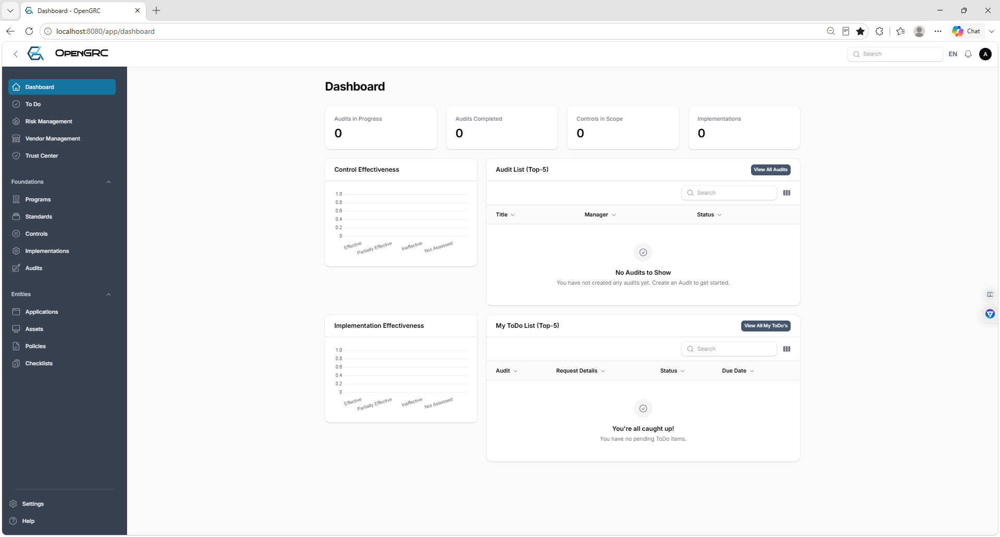

### 2. Program Configuration

The TechNova security and compliance program was configured with global scope and Security department ownership.

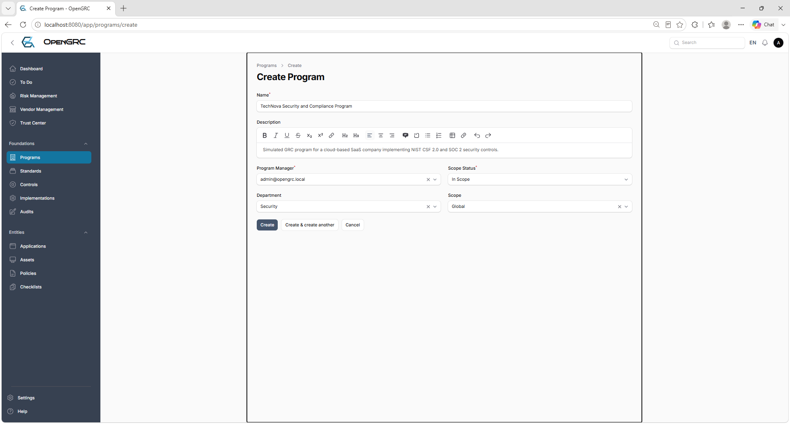

### 3. Program Created

The completed program record established the central structure for standards, controls, risks, and audits.

### 4. NIST CSF Standard Configuration

NIST Cybersecurity Framework 2.0 was configured as the governing standard.

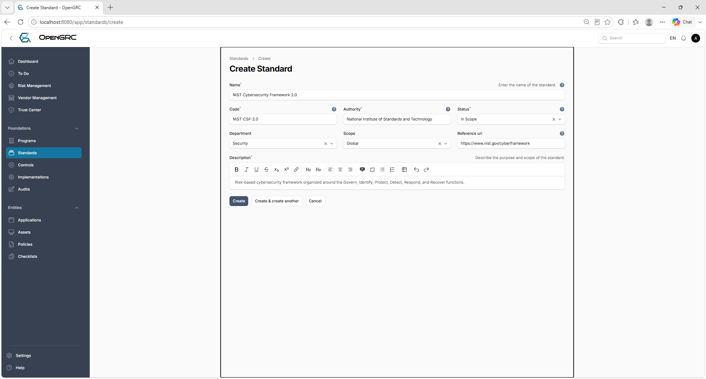

### 5. NIST CSF Standard Created

The framework record was placed in scope for the TechNova program.

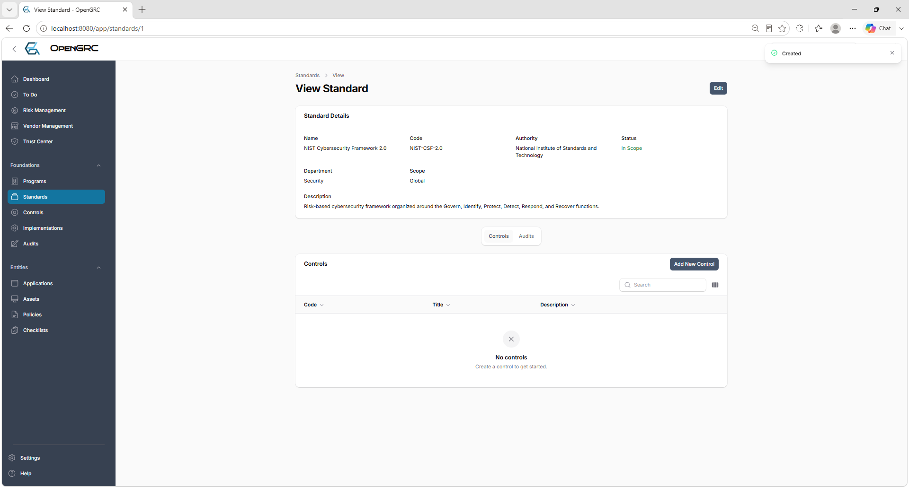

### 6. Standard Related to Program

The NIST CSF 2.0 standard was formally associated with the TechNova program.

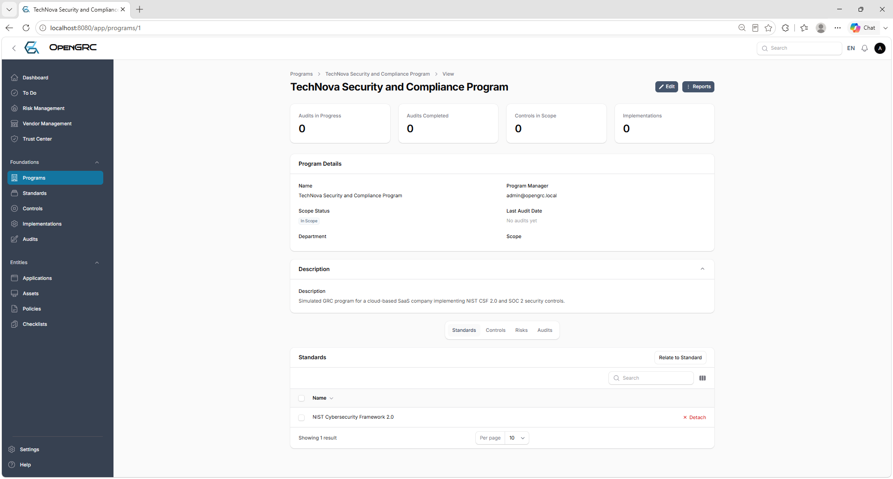

### 7. Govern Control Configuration

Control GV.RR-02 was documented with its classification, ownership, description, discussion, and test plan.

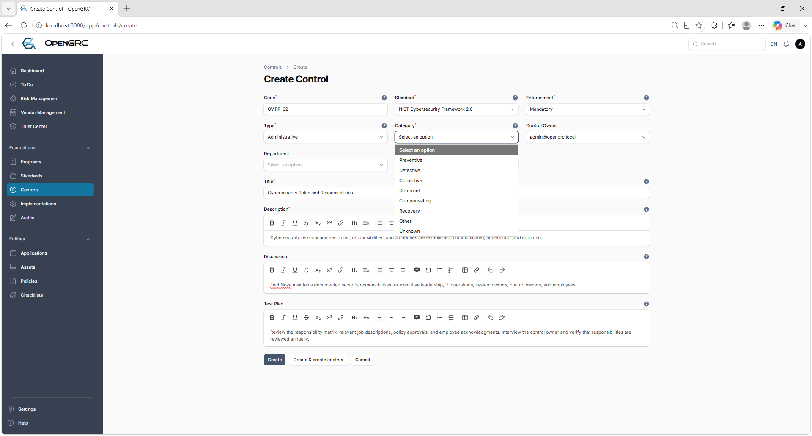

### 8. Govern Control Created

The completed control record shows the audit-ready control details.

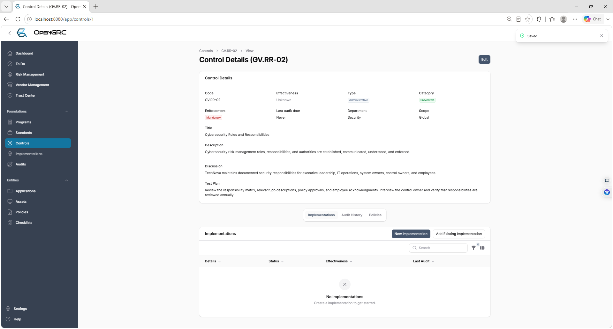

### 9. Six NIST Controls

Six controls spanning Govern, Identify, Protect, Detect, Respond, and Recover were added to the environment.

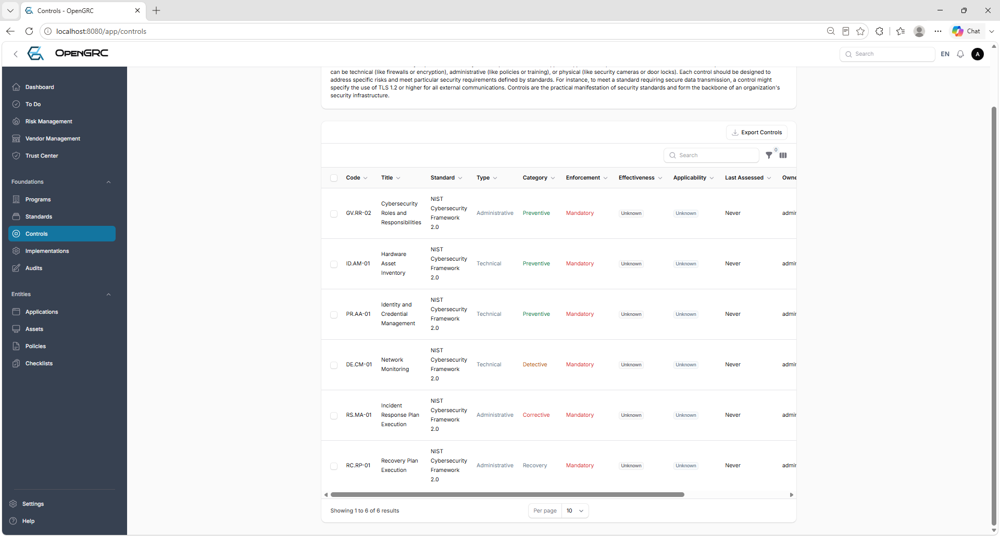

### 10. Controls Related to Program

All six controls were linked to the TechNova security and compliance program.

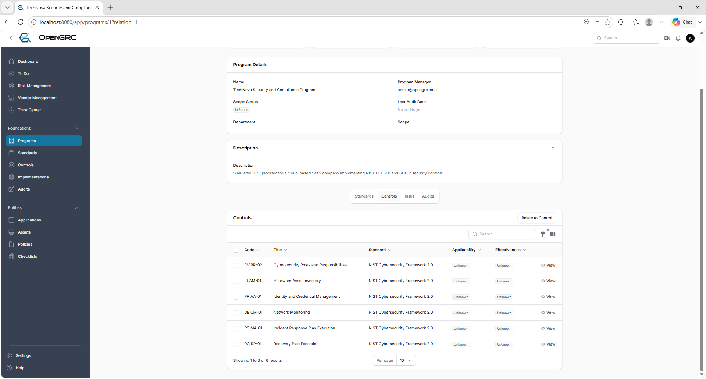

### 11. Control Implementations

Documented implementation records explain how each control operates in practice.

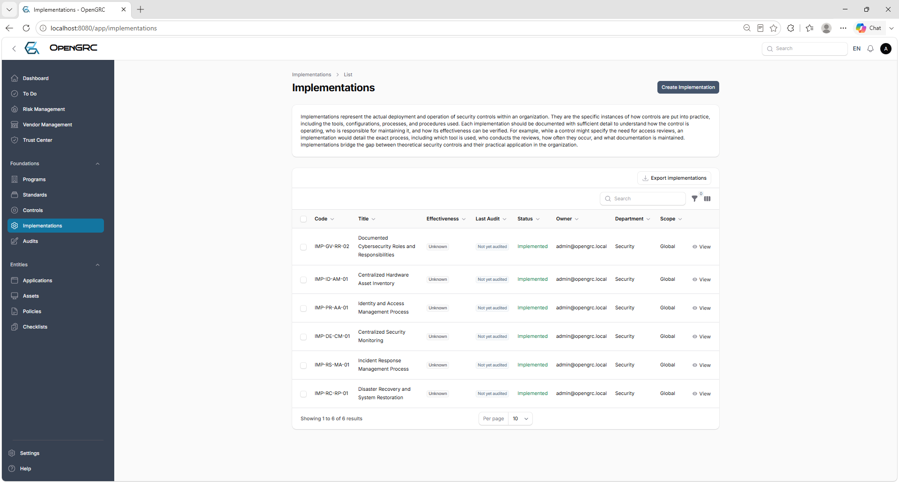

### 12. Unauthorized-Access Risk Analysis

The risk workflow was used to assess inherent and residual likelihood and impact.

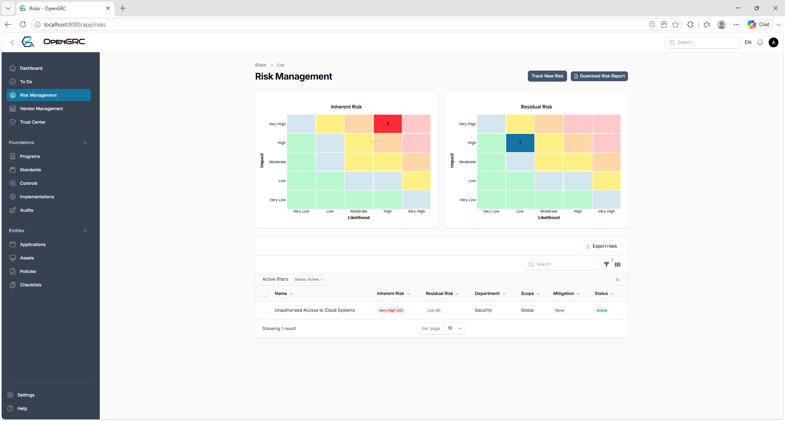

### 13. Risk Register and Heatmaps

The risk register summarizes inherent and residual exposure across the simulated organization.

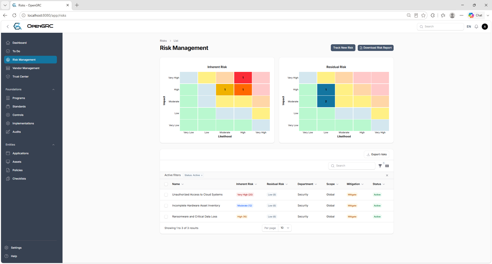

### 14. Risks Related to the Program

The three assessed risks were associated with the TechNova program for centralized oversight.

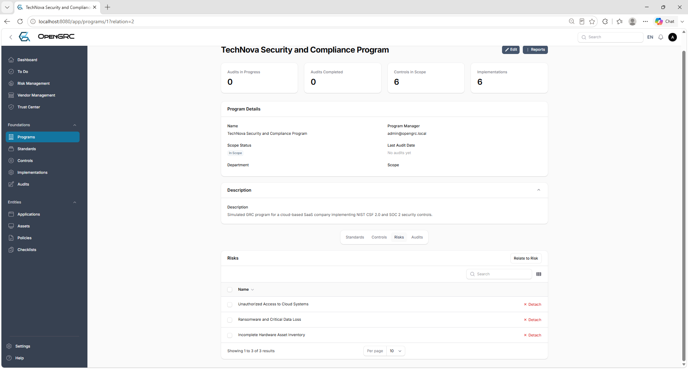

### 15. Control Audit Scope

All six controls were selected for the NIST CSF 2.0 program audit.

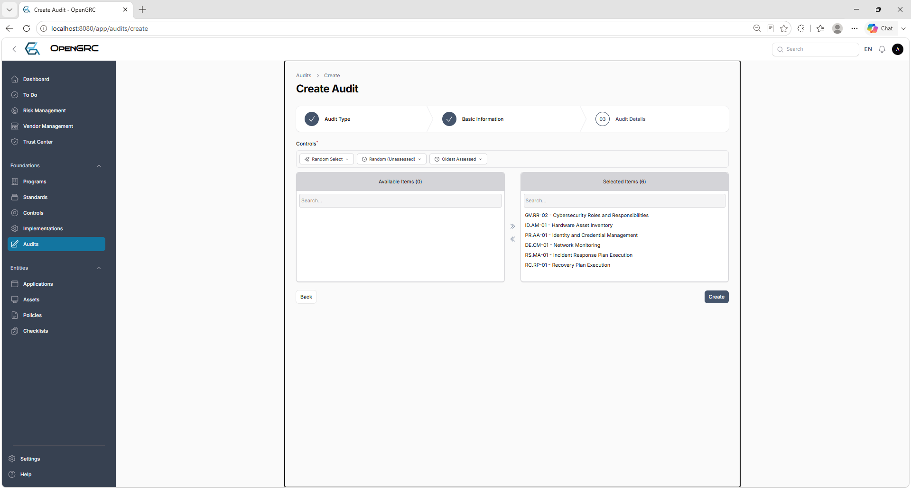

### 16. Completed Control Assessments

The control audit documented applicability, effectiveness, exceptions, and remediation recommendations.

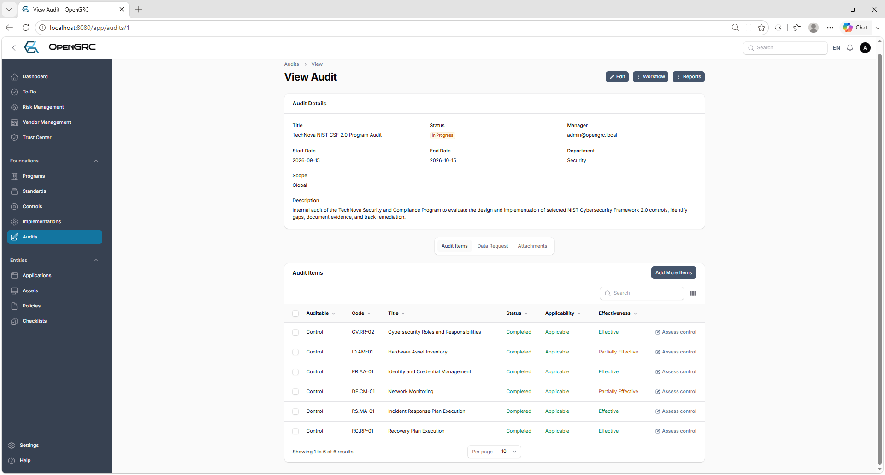

### 17. Control Audit Dashboard

The dashboard reflects the completed control audit: four Effective and two Partially Effective controls.

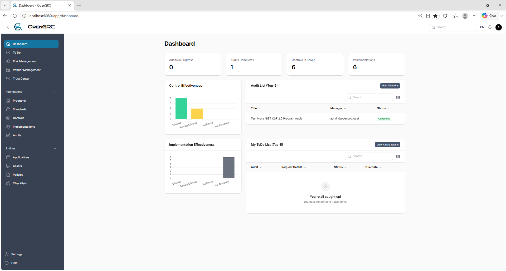

### 18. Implementation Audit Results

The second audit tested the operating effectiveness of all six control implementations.

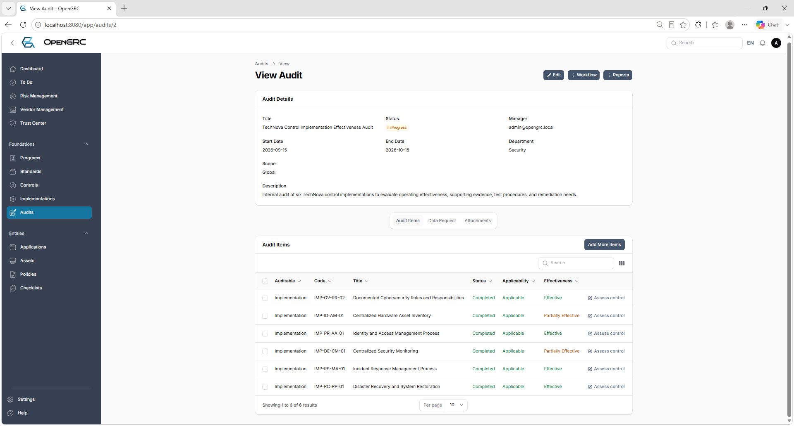

### 19. Final GRC Dashboard

The final dashboard shows two completed audits, six controls in scope, six implementations, and matching effectiveness results across both audit types.

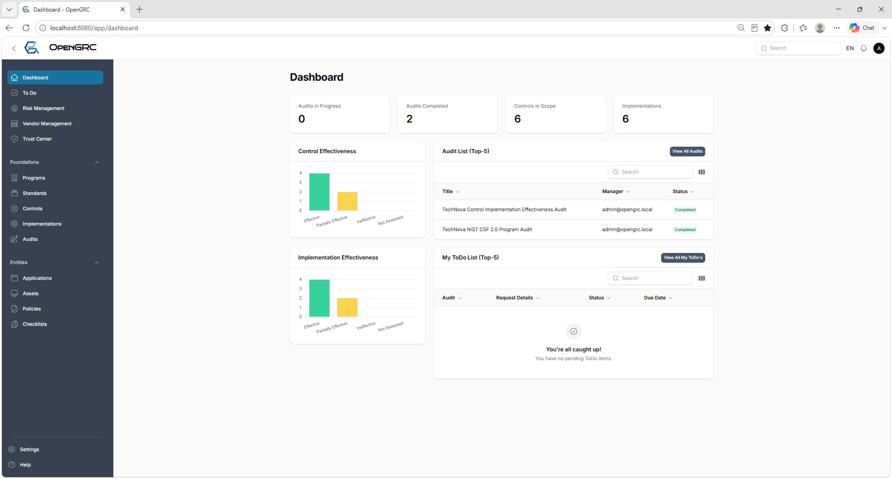

## Skills Demonstrated

- GRC program configuration and administration
- NIST CSF 2.0 control selection and documentation
- Control-to-implementation mapping
- Inherent and residual risk analysis
- Risk treatment and mitigation documentation
- Audit planning and scope selection
- Evidence review and control-effectiveness testing
- Findings, exceptions, and remediation recommendations
- GRC dashboard and executive-metric interpretation
- Docker-based deployment of a self-hosted GRC platform

## Key Outcome

This project demonstrates hands-on experience translating a cybersecurity framework into a functioning GRC program. It connects governance requirements to controls, implementations, risks, audits, findings, and measurable outcomes—the same core workflow used by GRC analysts to support compliance and risk-management decisions.

## Author

**Darwin Brown Jr.**  
[GitHub Profile](https://github.com/browndarwin231-Tech)
decritpion unde r350
